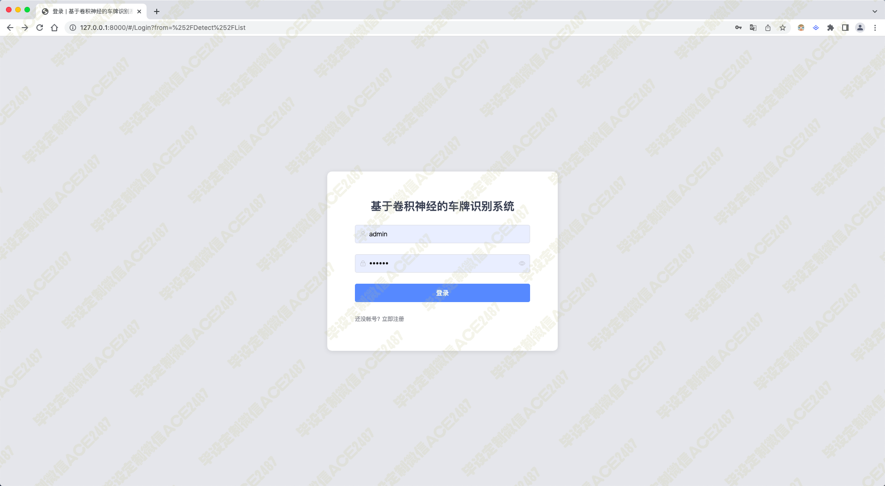

# 010 基于卷积神经的车牌识别系统-设计源码展示

> **代码有偿获取 可接受定制 微信联系方式: ACE2487，备注(BS)**

> 

## 技术栈

深度学习 pytorch tensorflow python 卷积神经 图像识别 车牌识别 神经网络

可识别：蓝牌、黄牌（单双行）、绿牌、大型新能源（黄绿）、领使馆车牌、警牌、武警牌（单双行）、军牌（单双行）、港澳出入境车牌、农用车牌、民航车牌

## 视频

> **点击查看 \>\>\> [https://www.bilibili.com/video/BV1XT411V73M/](https://www.bilibili.com/video/BV1XT411V73M/)**

## 截图

